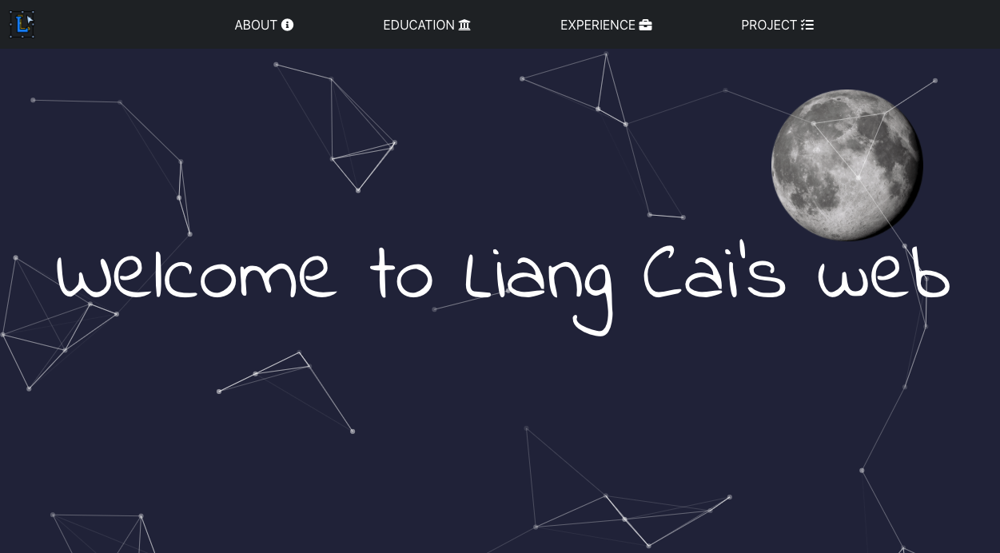

<!-- PROJECT LOGO -->

<br />

<p align="center">
    
</p>

<p align="center">
  My personal website
  <br />
  <br />
  <a href="https://liangcai.me">View my web</a>
</p>


<!-- TABLE OF CONTENTS -->

<details open="open">
  <summary>Table of Contents</summary>
  <ol>
    <li>
      <a href="#about-the-project">About The Project</a>
    </li>
    <li>
      <a href="#getting-started">Getting Started</a>
    </li>
</details>


<!-- ABOUT THE PROJECT -->

## About The Project

<p align="center">
    
</p>


### Built With

This section should list any major frameworks that you built your project using. Leave any add-ons/plugins for the acknowledgements section. Here are a few examples.

* React.js
* Bootstrap5
* Github Pages
* NameCheap Domain


<!-- GETTING STARTED -->
## Getting Started


### Prerequisites

This is an example of how to list things you need to use the software and how to install them.
* npm
  ```sh
  npm install npm@latest -g
  ```

### Installation

2. Clone the repo
   ```sh
   git clone 
   ```
3. Install NPM packages
   ```sh
   npm install
   ```

3. Develop locally

   ``` bash
   npm start
   ```

4. Build for Gh-Pages

   ``` bash
   npm run deploy
   ```

   